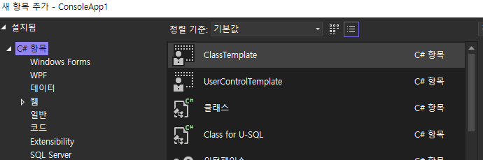

<h1 id="title">Visual studio - Code template</h1>

<h2 id="intro">Introduction</h2>

1. User control, Class define 등 코드 작업 시 일정한 코드가 반복적으로 삽입되는 경우가 있다.
2. Visual studio에 있는 `Template 내보내기` 기능을 통해, 매번 작성할 필요 없이 해당 코드를 빠르게 추가할 수 있다.
3. 필자는 코드 작성 시 두서없이 만들어지는 것을 막기 위해 미리 코드 구역을 나눈 템플릿을 추가하여 사용하고 있다.

<br><br>

<h2 id="howto">템플릿 내보내기 방법</h2>

1. 템플릿 내용 작성
    - 

2. 상단 메뉴의 프로젝트 - 템플릿 내보내기 클릭
    - 

3. 항목 템플릿 선택 및 내보낼 코드 파일 선택
    - 
    - 

4. 템플릿 이름 및 설명 작성
    - 

5. Visual studio에서 템플릿 항목 확인
    - 

<br><br>

<h2 id="altpath">다른 환경에서 사용 시</h2>

1. 다른 환경 (PC, 다른 Visual studio 버전) 등에서 사용 시 비주얼 스튜디오에서 사용하는 기본 내보내기 경로를 사용하지 못하는 경우가 있다.
2. 아래 경로에 넣은 후 Visual studio를 다시 켜주면 정상적으로 로드된다.
3. 내 PC - 문서 - 비주얼 스튜디오 (버전별 폴더 존재) - Templates - 이하 각 폴더
    - 

<br><br>

<h2 id="code">Code 템플릿 예시 - User Control</h2>

```csharp
namespace ConsoleApp1
{
    public partial class UserControlTemplate : UserControl
    {
        /*-------------------------------------------
         * 
         *      Design time properties
         * 
         -------------------------------------------*/


        /*-------------------------------------------
         * 
         *      Events
         * 
         -------------------------------------------*/


        /*-------------------------------------------
         * 
         *      Public members
         * 
         -------------------------------------------*/


        /*-------------------------------------------
         * 
         *      Private members
         * 
         -------------------------------------------*/


        /*-------------------------------------------
         * 
         *      Constructor / Destructor
         * 
         -------------------------------------------*/

        public UserControlTemplate()
        {
            InitializeComponent();
        }

        /*-------------------------------------------
         * 
         *      Event functions
         * 
         -------------------------------------------*/


        /*-------------------------------------------
         * 
         *      Public functions
         * 
         -------------------------------------------*/


        /*-------------------------------------------
         * 
         *      Private functions
         * 
         -------------------------------------------*/


        /*-------------------------------------------
         * 
         *      Helper functions
         * 
         -------------------------------------------*/
    }
}
```

<br><br>

<h2 id="reference">참조</h2>

1. [Class Template, UserControl Template 다운로드](https://github.com/peponi-paradise/Visual-Studio/tree/main/Code%20Template)