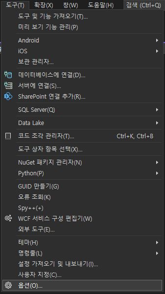
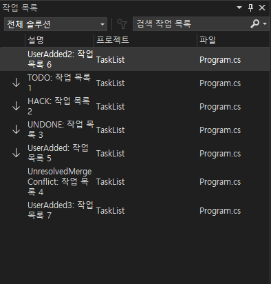

# Visual studio - Task list

<br>

## Table of Contents
- [Visual studio - Task list](#visual-studio---task-list)
  - [Table of Contents](#table-of-contents)
  - [Introduction](#introduction)
  - [작업 목록과 연동되는 주석 구성](#작업-목록과-연동되는-주석-구성)
  - [사용자 정의 토큰 등록 방법](#사용자-정의-토큰-등록-방법)
  - [Code](#code)
  - [Result](#result)

<br>

## Introduction

<br>

1. 코드 작업 시 주로 주석을 이용하여 TBD, 문제점 등을 기록하곤 한다.
2. 보통 주석에 자신만의 심볼을 달아 표시하는 경우가 많은데, 나중에 찾기 어려운 경우가 있다.
3. 주석을 이용한 작업 관리 향상을 위해 작업 목록 연동 기능이 있다.
    - 옵션에 등록되어 있는 토큰을 주석에 입력하면, 작업 목록 `(상단 메뉴 보기 - 작업 목록)` 과 자동으로 연동된다.
    - 작업 우선 순위에 따라 자동 정렬된다.
    - 사용자 정의 토큰을 지원한다.
    - 기본 토큰 지원 언어 : `C`, `C++`, `C#`, `Visual Basic`<br><br>
        |기본 토큰 이름|우선 순위|
        |--------|--------|
        |HACK|표준|
        |TODO|표준|
        |UNDONE|표준|
        |UnresolvedMergeConflict|높음|

<br>

## 작업 목록과 연동되는 주석 구성

<br>

> // TODO: 작업 목록 1
>> 1. 주석 마커 : //
>> 2. 토큰 : TODO, HACK 등
>> 3. 주석 내용

<br>

## 사용자 정의 토큰 등록 방법

<br>

1. 비주얼 스튜디오 옵션을 연다 `(상단 메뉴 도구 - 옵션)`<br>
    
2. `환경 - 작업 목록` 화면에서 원하는 토큰 이름을 등록한다<br>
    

<br>

## Code

<br>

```csharp
/*
 작업 목록에 연동되는 주석 구성
1. 주석 마커 : //
2. 토큰 : TODO, HACK, ...)
3. 주석 내용
 */

// C/C++, C#, Visual Basic용 기본 토큰 예시

// TODO: 작업 목록 1
// HACK: 작업 목록 2
// UNDONE: 작업 목록 3
// UnresolvedMergeConflict: 작업 목록 4

// 사용자 정의 토큰 예시

// UserAdded: 작업 목록 5
// UserAdded2: 작업 목록 6
// UserAdded3: 작업 목록 7
```

<br>

## Result

<br>

> `우선 순위` 낮음 (위) - 높음 (아래) 순으로 자동 정렬



<br>